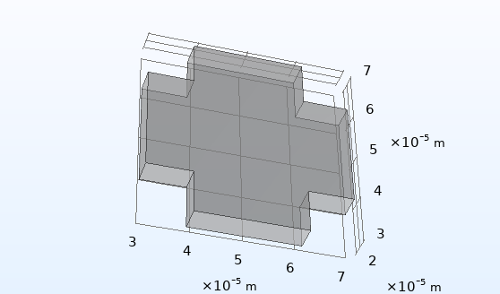
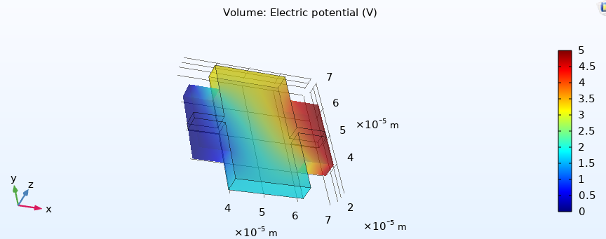
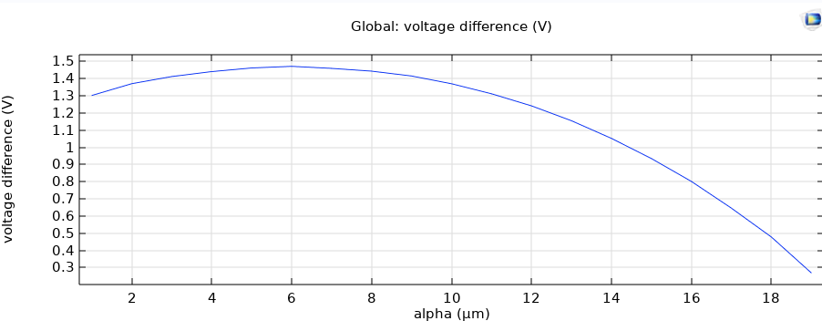
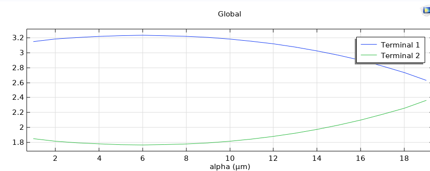

### Simulation of a Hall Effect sensor

*Mohammad Ali Ghorbani* - report for the project of *Advanced Solid State Physics* graduate course, presented by *Dr. Manavizadeh* @ KN Toosi University of Technology

#### Introduction

A suggested structure, as a Hall Effect sensor, is studied by simulation, using COMSOL Multiphysics

Dimensions: The structure is a block of `40` \* `40` \* `5` `um` with an indent that can be shown in the image. the indent depth `alpha` can effect the sensitivity, and there might be an optimum value for this indent depth `alpha`.

A Constant potential difference of `5` `V` is applied to the X-axis boundaries and the `alpha` is changed only in Y-axis.

A constant uniform magnetic flux density of 0.5 T is applied on the pure vacuum space, along the Z-axis and changing the value of  `alpha` from `1` to `19` `um`, The optimum `alpha` is determined to achieve more voltage difference along Y-axis.

#### Results 

The hall effect is clearly observable from the simulation results, on an N-type doped Silicon with impurity of `2E16` 

based on the results from `alpha` parameter sweep, the optimum value of `6` `um` is achieved (with Voltage difference of `1.460200` `V` ).

The table of results:

| alpha [um] | Terminal 1(V) | Terminal 2(V) | diffrence(V) |
| ---------- | ------------- | ------------- | ------------ |
| 1          | 3.1500000     | 1.84910000    | 1.300900     |
| 2          | 3.1900000     | 1.81500000    | 1.375000     |
| 3          | 3.2100000     | 1.79340000    | 1.416600     |
| 4          | 3.2200000     | 1.77970000    | 1.440300     |
| 5          | 3.2309000     | 1.76830000    | 1.462600     |
| 6          | 3.2366000     | 1.76460000    | 1.472000     |
| 7          | 3.2300000     | 1.76980000    | 1.460200     |
| 8          | 3.2219000     | 1.77790000    | 1.444000     |
| 9          | 3.2079000     | 1.79210000    | 1.415800     |
| 10         | 3.1900000     | 1.81450000    | 1.375500     |
| 11         | 3.1600000     | 1.84360000    | 1.316400     |
| 12         | 3.1200000     | 1.87980000    | 1.240200     |
| 13         | 3.0800000     | 1.92260000    | 1.157400     |
| 14         | 3.0259000     | 1.97370000    | 1.052200     |
| 15         | 2.9674000     | 2.03260000    | 0.934800     |
| 16         | 2.9006000     | 2.09920000    | 0.801400     |
| 17         | 2.8200000     | 2.17610000    | 0.643900     |
| 18         | 2.7400000     | 2.25790000    | 0.482100     |
| 19         | 2.6300000     | 2.36290000    | 0.267100     |

#### Materials

The `mph` file for this project  is available in [This link](https://drive.google.com/file/d/1_isj77k_7ZAcghNogqyPFzzjcNhAKWKh/view?usp=sharing) which is the COMSOL workspace file and hitting `COMPUTE` button will result in parameter sweep and plotting the results.

Please [write your opinion about this project to me](mailto:mohammad.alighorbani@email.kntu.ac.ir). I'm open to continuing this work if you like to co-operate

